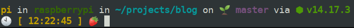
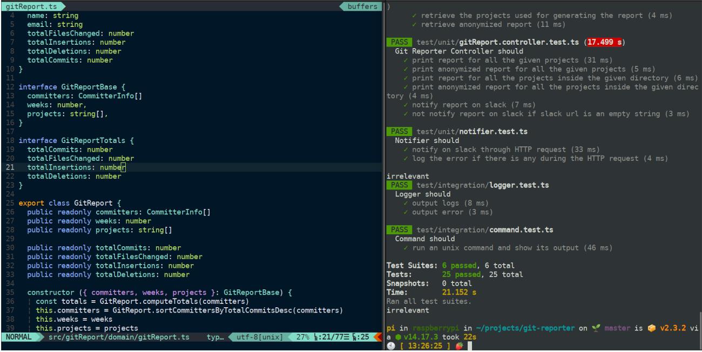

Trabajar desde una [Raspberry Pi](https://www.raspberrypi.org/products) puede parecer una locura, pero la realidad es
que para cierto tipo de tareas es más que suficiente. Además, al ser tan pequeña la puedes llevar a cualquier lado y
usarla tanto como un ordenador como a través de ssh con tu tablet o móvil como explico
en [este post](/blog/2021/raspberry-pi-en-tu-ipad). Por otro lado, también es una forma muy barata de acceder a un
ordenador con el que poder programar, aunque tenga sus limitaciones, ya que al final no deja de ser un procesador de 4
núcleos a 1.5 GHz en el mejor de los casos.

Precisamente por esta última razón, lo que sale más rentable es que si vas a trabajar con tu Raspberry que sea desde un
terminal, ya que conectar una Raspberry a una pantalla y usar los programas con su entorno gráfico completo puede ser
desesperante. Al menos para mí lo es, por lo que para montar mi entorno de desarrollo en mi Raspberry me he basado 100%
en herramientas que funcionan por terminal y servidores web para usar el navegador web del iPad como cliente.

## Mi entorno de desarrollo 

El entorno de desarrollo que he preparado para mi Raspberry Pi se compone de lo siguiente:
    
- [zsh](#zsh)
- [zim](#zim)
- [Starship](#starship)
- [Node.js](#nodejs)
- [Neovim](#neovim)

A continuación te explico paso a paso qué es y como instalar cada una de las herramientas. Por cierto, **esta instalación
la puedes hacer tanto en tu Raspberry como en cualquier sistema operativo basado en Debian o Ubuntu**. En mi caso tengo en
mi sobremesa las mismas herramientas y los comandos que he usado son los mismos.

<div id="zsh"></div>

### zsh

[zsh](https://www.zsh.org) es una versión extendida [sh](https://es.wikipedia.org/wiki/Bourne_Shell), el intérprete de
órdenes que usaba la terminal (también conocido simplemente como shell) de los sistemas UNIX por defecto desde finales
de los 70. 20 años después llegó que [Bash](https://www.gnu.org/software/bash/) pasó a ser el nuevo intérprete por
defecto, que es lo que encuentras hoy en cualquier servidor Linux.

En macOS a partir de 2019 usa zsh como shell por defecto, después de haber tenido por defecto Bash durante años. Bash
sigue siendo el shell por defecto en Ubuntu y también en Raspbian, el sistema operativo por defecto para la
Raspberry Pi.

Entonces, si Bash es tan usado, ¿cuál está el problema? Realmente Bash no tiene ningún problema, pero es que zsh tiene
algunas funcionalidades que hace que sea mucho más cómodo trabajar desde la terminal, como por ejemplo la sugerencia y
autocompletado de comandos. Además, existen frameworks para zsh que nos permiten personalizar y potenciar aún más el trabajo
desde la terminal gracias al uso de plugins.

Para instalar zsh sólo tienes que ejecutar los siguientes comandos:

```shell
sudo apt install zsh -y
sudo chsh -s $(which zsh)
```

El primer comando instalará zsh y el segundo cambiará nuestra shell por defecto para que sea zsh en vez de Bash. A partir de
ahora toda nueva terminal que abras usará zsh en vez de Bash.

<div id="zim"></div>

### zim

[zim](https://zimfw.sh) es un framework para zsh, permitiéndonos personalizar y extender zsh fácilmente y mantenerlo
ligero. Además, la configuración que trae zim por defecto es más que suficiente para mejorar notablemente nuestra
experiencia en zsh. Para instalarlo es tan fácil como ejecutar el siguiente comando en tu terminal:

```shell
sudo curl -fsSL https://raw.githubusercontent.com/zimfw/install/master/install.zsh | bash
```

Ya está, eso es todo lo que tienes que hacer para instalar zim.

<div id="starship"></div>

### Starship

¿Alguna vez has visto la terminal de otra persona que tiene todo supercolorido y hasta con emojis?
Pues [Starship](https://starship.rs/es-ES/) nos da justo eso de una forma supersimple. Lo único que tienes que hacer es instalarlo:

```shell
sh -c "$(curl -fsSL https://starship.rs/install.sh)"
```

Y después añadir `eval "$(starship init zsh)"` a tu .zshrc para poder arrancar Starship cada vez que abras una terminal:

```shell
echo 'eval "$(starship init zsh)"' >> $HOME/.zshrc
```

Así es como luce Starship en mi Raspberry:


A continuación te comparto la configuración que tengo para hacer que se vea de esta manera. De todos modos, siempre
puedes revisar la [documentación de Starship](https://starship.rs/es-ES/config/) y configurarlo a tu gusto.

```
[character]
format = "🍓 "

[git_branch]
symbol = "🌱 "

[java]
disabled = false

[nodejs]
symbol = "⬢ "

[package]
symbol = "📦 "

[directory]
fish_style_pwd_dir_length = 10

[time]
disabled = false
format = '🕙 [\[ $time \]]($style) '
time_format = "%T"
```

Realmente todo esto también se podría hacer con zsh y zim, pero la ventaja que le veo a Starship es que por un lado es
superfácil de configurar y por otro es que es compatible con varios shells como Bash o Powershell, por ejemplo. 

<div id="nodejs"></div>

### Node.js

¡Oh! ¡Qué gran sorpresa, quiero [Node.js](https://nodejs.org/es/) en mi entorno de desarrollo! Por si no lo sabías, soy
un frikazo de JavaScript y TypeScript, aparte que trabajo cada día con Node.js y es mi expertise. Por tanto, tiene mucho
sentido que quiera tener Node.js en cualquier ordenador que vaya a usar.

Sin embargo, no vamos a instalar Node.js tal cual desde el gestor de paquetes de apt, sino que vamos a
usar [nvm](https://github.com/nvm-sh/nvm). nvm son las siglas de Node Version Manager, que se traduce como *gestor de
versiones de Node.js*. Por lo que podrás intuir lo que hace nvm es instalar Node.js por nosotros y gestionar las
diferentes versiones por sí mismo. De esta manera puedes tener varias versiones de Node.js en tu ordenador y usar la que
necesites para el proyecto en el que vayas a trabajar.

Además, hay que tener en cuenta que [cada año salen 2 versiones de Node.js](https://nodejs.org/es/about/releases/), una
versión LTS y otra en la que se van preparando las nuevas funcionalidades experimentales y de la que saldrá la versión
LTS del año siguiente. Esto significa que cada año sería recomendable que te pasaras a la siguiente LTS para poder
aprovechar las novedades que salen cada año. Hacer todo esto con binarios o los gestores de paquetes del sistema
operativo puede ser un dolor, por lo que mejor usar nvm. Otro punto a tener en cuenta es que nvm es lo que recomiendan que uses en la certificación de
Node.js para instalar Node.js.

Para instalar nvm ejecutamos: 
```shell
curl -o- https://raw.githubusercontent.com/nvm-sh/nvm/v0.38.0/install.sh | zsh
```

Una vez lo hayamos instalado nos pedirá que ejecutemos los siguientes comandos para que podamos usar nvm sobre la marcha:
```shell
export NVM_DIR="$([ -z "${XDG_CONFIG_HOME-}" ] && printf %s "${HOME}/.nvm" || printf %s "${XDG_CONFIG_HOME}/nvm")"
[ -s "$NVM_DIR/nvm.sh" ] && \. "$NVM_DIR/nvm.sh"
```

Con esto ya podríamos empezar a usar nvm e instalar la versión LTS de Node.js:
```shell
nvm install --lts
```

Y ya está, con esto ya deberías tener Node.js y npm instalados.

<div id="neovim"></div>

### Neovim

[Neovim](https://neovim.io) es un editor de texto que se lanza directamente en la terminal y por tanto puedes abrir
directamente en cualquier terminal, permitiéndote modificar archivos por ssh. Está basado en [vim](https://www.vim.org),
por lo que si conoces o has usado vim en algún momento no te supondrá ninguna dificultad utilizar Neovim. 

Realmente no tengo ninguna razón de peso para usar Neovim frente a vim, simplemente vi que lo
usaba [Matteo Collina](https://twitter.com/matteocollina) y me pareció interesante. 

Al contrario que el resto de herramientas, la instalación de Neovim no es tan fácil ya que requiere que instalemos
dependencias e incluso el propio proyecto para después compilarlo en nuestra Raspberry. Aun así, verás que no es tan
complicado, simplemente requerirá más tiempo.

#### 1. Instalar dependencias

Para compilar y usar Neovim necesitamos instalar algunas dependencias:

```shell
sudo apt-get install ninja-build gettext libtool libtool-bin autoconf automake cmake g++ pkg-config unzip -y
sudo apt install xclip xsel -y
sudo apt install python3-pip -y
sudo apt install python-pip -y
sudo python3 -m pip install neovim
sudo python -m pip install neovim
python3 -m pip install --upgrade neovim
python -m pip install --upgrade neovim
npm i -g neovim
```

#### 2. Compilar Neovim e instalarlo

Una vez tenemos las dependencias instaladas debemos descargar el proyecto de Neovim desde Github, compilarlo e
instalarlo:

```shell
# Descargamos el proyecto
mkdir -p $HOME/apps # Prefiero tener Neovim en una carpeta llamada apps dentro de mi home
cd $HOME/apps
git clone https://github.com/neovim/neovim
# Compilamos Neovim
cd neovim
git checkout stable
make -j4
# Instalamos Neovim
make CMAKE_BUILD_TYPE=RelWithDebInfo
sudo make install
```

#### 3. Instalar los plugins y configuración

Neovim no es mi entorno de desarrollo habitual, sólo lo uso desde la Raspberry o cuando simplemente voy a editar
archivos desde la terminal. Debido a esto, no tenía ni idea de cómo configurarlo o qué plugins usar para que se
pareciera lo máximo posible a IntelliJ. Algunas cosas las investigué y aprendí a configurarlas, pero la gran mayoría lo
cogí prestado de [Santos Gallegos](https://stsewd.dev). El resultado está
en [este gist](https://gist.github.com/ulisesantana/5f13880a18541459ccd90ef38d9e9fbe#file-init-vim), el cual pondría en
este post directamente, pero es tan largo que creo que no merece la pena.

Para poder hacer uso de los plugins necesitaremos instalar vim-plug que es el sistema de plugins heredado de vim. A
partir de ahí simplemente es crear un fichero de configuración y lanzar el comando de instalación de plugins.

```shell
# Instalar vim-plug
curl -fLo $HOME/.local/share/nvim/site/autoload/plug.vim --create-dirs \
       https://raw.githubusercontent.com/junegunn/vim-plug/master/plug.vim
# Crear carpeta de configuración de Neovim
mkdir -p $HOME/.config/nvim
# Copiar mi configuración para Neovim desde mi gist en Github
curl https://gist.githubusercontent.com/ulisesantana/5f13880a18541459ccd90ef38d9e9fbe/raw/3e87c92b116b28a5be604dbea9dd054bc29e5987/init.vim > $HOME/.config/nvim/init.vim
# Instalar plugins
nvim +PlugInstall
```

Si has hecho todo esto correctamente al abrir un fichero con el comando `nvim` deberías ver algo parecido a la terminal
de la izquierda:



Con esto ya tendrás tu Raspberry Pi preparada como entorno de desarrollo en el podrás programar, escribir tus entradas
de blog o hacer [katas](https://kata-log.rocks).
