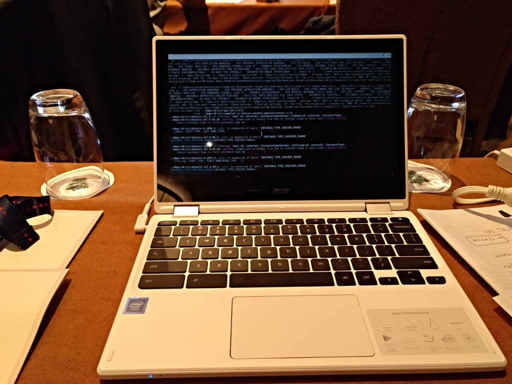

    

        TL;DR
    

> No te compares contra internet. El objetivo final de tu vida debe ser hacer
> lo que te haga sentir feliz. Si quieres ser mejor en algo disfruta del
> camino, disfruta del proceso, y no tengas prisa por llegar al objetivo
> final. De nada te sirve ser el experto o la experta en un campo si por el
> camino te dejas la salud, tu familia o tu vida personal.
>
> Si hay una época
> en la que te apetece darlo todo y exprimir cada día aprendiendo e
> investigando, adelante. Sin embargo, si tienes otra que lo que quieres es
> terminar de trabajar y salir a la playa o pasarte la tarde con la gente
> que quieres, no te sientas culpable. La vida está para disfrutarla.

Por redes sociales cada día ves como otras personas están haciendo cosas:
completando cursos sobre alguna tecnología, presentando sus side projects,
contribuyendo a proyectos open source, hablando del libro que acaban de leer o
terminar de escribir, compartiendo la charla que dieron en una conferencia, etc.

Un día tras otro ves como en tu alrededor todo el mundo habla de todo lo que
aprende y avanza en su carrera mientras tú ayer terminabas esa serie en Netflix
o veías vídeos de gatitos en YouTube. Espera, ¿todo el mundo? ¿En serio? No,
probablemente no. Lo que ves por tus redes sociales es sólo un pequeño espectro
de la realidad. Por un lado, ves sólo a la gente que sigues con lo cual no ves
lo que está haciendo todo el mundo. Por otro lado, ves lo que la gente que sigas
quiere que veas. ¿A que no publicas que esta semana no has hecho nada que no sea
estar tirado en el sofá, jugando a cualquier videojuego o salir a dar una
vuelta? Por regla general las personas comparten la parte interesante de sus
vidas o cosas que les reconfortan. Por no hablar del hecho de que las redes
sociales son los escaparates donde nos vendemos al resto del mundo. La vida de
una persona es mucho más que lo que muestra en redes sociales.

Con este panorama da la sensación de que si eres profesional del software estás
todo el día detrás de la pantalla haciendo cursos, proyectos y leyendo libros.
Esto puede ser cierto por épocas, pero es inviable pensar que vas a estar así el
resto de tu vida. Aprendizaje continuo sí, pasar 80 horas a la semana delante
del ordenador, no. Eres responsable de tu aprendizaje, pero también 
responsable de tu salud y no quemarte por haberte pasado de exigente. Yo 
siento que a veces tenía el límite demasiado borroso y tuve épocas malas a 
raíz de no saber cuando parar.

Me pasé desde 2015 hasta 2020 sin descansar en las vacaciones que tenía. Desde
que comencé el ciclo superior de desarrollo de aplicaciones web me puse como
objetivo ser un buen profesional y dominar JavaScript para tener buenas
oportunidades laborales. Eso conllevó a que pasara una media de 12 horas diarias
frente al ordenador y las vacaciones que tenía como estudiante me las pasé o
trabajando y estudiando en mis ratos libres o cursando cursos de Udemy para
comprender el stack MEAN.

Una vez terminé el ciclo y comencé a trabajar mis vacaciones las destiné a
seguir estudiando e ir a toda conferencia que pudiera. Aparte de que durante el
resto del año dedicaba al menos un par de horas diarias a investigar sobre
JavaScript, NodeJS o cualquier cosa nueva a la me estuviera enfrentando. En
ningún momento diré que lo pasé mal, me apasiona el software y el desarrollo web
y disfrutaba el aprendizaje. Aparte, eso me dio la oportunidad de viajar hacer
turismo en diferentes ciudades europeas. Como dice el dicho: *Que me quiten lo
bailao*.

<figure role="group" id="chromebook-nodeconf">
    
    <figcaption>
        <small>
            En mi primera NodeCONF EU fui a un taller para hacer mi primera aportación
        a NodeJS. El problema es que fui con un chromebook que tardó casi 2 horas en
        compilar NodeJS.
        </small>
    </figcaption>
</figure>

Sin embargo, pese a todo este esfuerzo seguía sintiendo que no estaba llegando a
mis objetivos, que no paraba de proponerme cosas que al final no completaba. 
Mientras tanto, seguía viendo como en Twitter todos los días alguien compartía
algún progreso que hacía en su carrera. Yo crecía profesionalmente, pero seguía
sintiéndome pequeño. Y es normal, me comparaba con personas con 10 años de
experiencia y personas que no conocía. Repito, me comparaba.

Compararme con los demás era el mayor problema. Cada persona es única y tiene un
ritmo de aprendizaje diferente. Además, cada persona tiene una situación
diferente. No todo el mundo tiene las mismas responsabilidades, no es lo mismo
un estudiante que vive en casa de sus padres y que no tiene que preocuparse de
mantener la casa, hacer la compra, hacer de comer y limpiar que una persona
independizada que tiene que encargarse de absolutamente todo. Y ya no te cuento
si a esto le añades el tener personas a tu cargo, ya sean niños, ancianos o
personas con alguna clase de dependencia.

En otras palabras: Todo el mundo vive unas circunstancias diferentes tanto
internas como externas y eso condiciona la forma y velocidad a la que llegamos a
nuestras metas.

Por tanto tienes la responsabilidad de decidir qué es lo que quieres aprender y
por qué. Debes hacer un ejercicio de introspección y plantearnos qué es lo que
queremos y cual es el objetivo real. En caso de no llegar a tus objetivos o
sentir que no estás avanzando debes plantearte cual es el problema y con total
sinceridad responderte qué es lo que te está bloqueando. En ocasiones es mejor
parar y replantearse las prioridades. Hay momentos de la vida que tienes que
vivir, que tienes que compartir con la gente que quieres. Sin más, sin sentirte
culpable porque te dé la sensación de que la comunidad esté avanzando mientras
tú estás disfrutando de la vida. Hay otros momentos en los que la pasión será tu
motor y estudiarás, harás pet projects y todo lo que necesites. También puedes
llegar a un punto intermedio en el que te propones estudiar un mínimo semanal,
pero que te deje hueco para disfrutar de tu vida y de la gente a la que quieres.
Todo se basa en el equilibrio entre vida y trabajo porque al final trabajamos
para vivir, no vivimos para trabajar.
