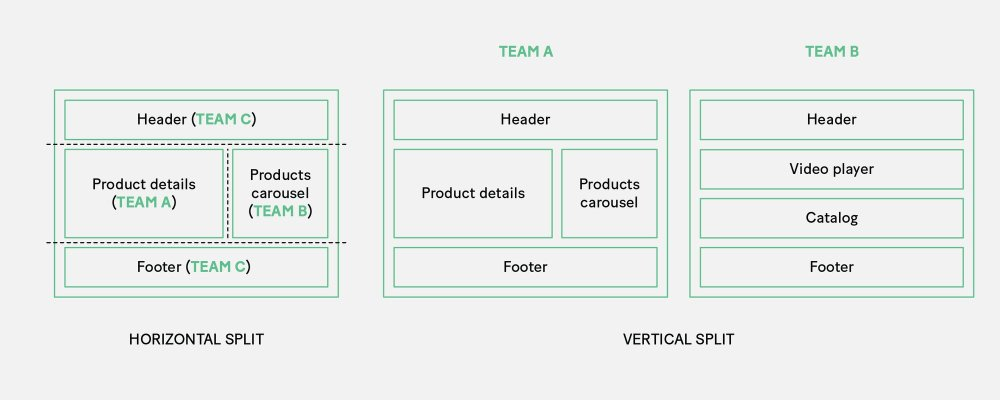

Cada vez se habla más de micro frontends, una arquitectura inspirada en la 
arquitectura de [microservicios](https://microservices.io/) nacida de la necesidad 
de dar más flexibilidad al frontend. Por lo general, independientemente de como 
sea el backend, el frontend de las aplicaciones de hoy en día están desarrolladas 
por un único equipo y a medida que el producto evoluciona y se añaden funcionalidades 
el frontend se hace más grande, difícil de mantener y complejo para las nuevas incorporaciones al equipo de frontend. 
En las siguientes arquitecturas vemos como el frontend es siempre un monolito:

<figure role="group" id="monolith-frontback-microservices">
    
    <figcaption>
        <small>
            Imagen de <a href="https://micro-frontends.org" target="_blank"> 
            https://micro-frontends.org</a>
        </small>
    </figcaption>
</figure>

De izquierda a derecha vamos pasando de una arquitectura más acoplada a menos acoplada llegando finalmente a la 
arquitectura de microservicios. En todas el frontend sigue siendo un único equipo que responde a todo y que debe 
comunicarse con múltiples equipos para saber cómo integrarse con el backend. En la siguiente imagen vemos cual 
sería el siguiente paso lógico: micro frontends.

<figure role="group" id="verticals-headline">
    
    <figcaption>
        <small>
            Imagen de <a href="https://micro-frontends.org" target="_blank"> 
            https://micro-frontends.org</a>
        </small>
    </figcaption>
</figure>

Ahora vemos como ya no hay equipos dependiendo de si es frontend o backend, sino que se definen por funcionalidades 
de la aplicación muy bien definidas. Tal vez por esto micro frontends es una arquitectura que cada vez va ganando 
más tracción y empresas como Ikea, DAZN o Zalando la usan en sus aplicaciones. 
[Luca Mezzalira](https://lucamezzalira.com/about/), vicepresidente de arquitectura en DAZN, define los micro 
frontends de una manera clara y concisa:

> Los micro frontends son la representación técnica de un subdominio empresarial, permiten implementaciones 
> independientes con la misma o diferente elección de tecnología, finalmente evitando compartir lógica con otros 
> subdominios y son propiedad de un solo equipo.
> 
> <small>Luca Mezzalira</small>

Tal como define Luca, cada equipo es responsable de una parte del dominio del negocio y tiene total autonomía sobre 
el mismo, dándole toda la libertad que necesita para innovar y ofrecer la mejor solución sin afectar al resto de la 
aplicación. Esto permite a grandes empresas poder dividir su dominio y delegarlo a equipos que se comportan como 
startups, libres de tomar las decisiones que necesiten para poder validar el producto lo antes posible.

Estos equipos a cambio de esa libertad y agilidad tiene toda la responsabilidad sobre esa parte del dominio, por lo 
que debe ser un equipo multifuncional que se encargue de:

- Desarrollo
- Testing
- Build
- Despliegue
- Documentar
- Dar soporte vital al micro frontend

Por otro lado, la independencia tecnológica que te brinda la arquitectura con micro frontends te permite poder 
elegir la herramienta que mejor se ajusta al problema que tienes que solucionar, ya que no es lo mismo una landing 
page que la página del perfil del usuario. Las necesidades en cuanto a tráfico y qué puede hacer o no el usuario 
final son muy diferentes. En el caso de la landing page te interesa generar contenido estático que poder cachear 
para minimizar el tiempo de respuesta, ya que al fin y al cabo es la parte que vende el producto, mientras que el 
perfil de usuario contiene información dinámica y no es donde el usuario va a pasar la mayor parte del tiempo una 
vez se dé de alta en la plataforma.

## Vertical u Horizontal
A la hora de añadir micro frontends en una aplicación podemos abordarlo de 
dos maneras: integrando los micro frontends vertical u horizontalmente. 
Verticalmente estaríamos definiendo una página entera como un micro frontend,
mientras que horizontalmente estamos limitando el micro frontend a una parte 
de la página. 

<figure role="group" id="micro-frontend-split">
    
    <figcaption>
        <small>
            Imagen de <a href="https://increment.com/frontend/micro-frontends-in-context/" target="_blank"> 
            un post de Increment</a> sobre micro frontends
        </small>
    </figcaption>
</figure>

La ventaja de integrar un micro frontend verticalmente es que es más fácil 
porque la página se carga entera y no hay que gestionar la comunicación 
entre micro frontends. Por otro lado, integrar un frontend horizontalmente 
nos da mayor libertad y flexibilidad, pero es probable que tengamos que 
gestionar la comunicación entre los diferentes micro frontends que se 
muestran en la página.

## Comunicación entre micro frontends

En caso de que decidas integrar los micro frontends horizontalmente es muy probable que necesites comunicarlos entre
ellos. En los proyectos en los que he implementado micro frontends ha sido de esta manera y cuando necesitaba
comunicarlos entre ellos usaba los [*message events del
DOM*](https://developer.mozilla.org/en-US/docs/Web/API/Window/message_event). La contrapartida de hacerlo así es que
tienes a todos los micro frontends escuchando todo el tiempo y procesando los mensajes que a lo mejor no les interesa.
Por otro lado, está la opción de usar [*Custom
events*](https://developer.mozilla.org/en-US/docs/Web/API/CustomEvent/CustomEvent), con los que puedes ser más selectivo
en qué micro frontends escuchan a qué eventos. 

Otra opción posible es que si estás haciendo tu aplicación en React y todos tus micro frontends están en React puedes
tener una aplicación padre que orqueste los datos y que los micro frontends reaccionen ante ellos. De esta manera puedes
hacer que cada micro frontend sea un componente de React y exportarlo como un paquete de npm. Así es como hice
un [pet project para hacer una prueba de concepto de micro frontends](https://www.youtube.com/watch?v=UEIiW-rU6G8). En
este [vídeo](https://www.youtube.com/watch?v=UEIiW-rU6G8) explico el proyecto y los micro frontends. No obstante, esta
implementación no sigue del todo la filosofía de micro frontends, ya que está anclada a React, perdiendo agilidad e
innovación a la hora de usar otras soluciones para el frontend.

Para los micro frontends integrados verticalmente es más fácil comunicarlos entre ellos, ya que puedes jugar con la URL
y pasar datos por *query string* o usar el *local storage* del navegador.

## Conclusión

Usar micro frontends es una opción muy interesante a tener en cuenta a la hora de desarrollar aplicaciones. Sin embargo,
no es una bala de plata y además hay que tener en cuenta más cosas que no he mencionado en este artículo como es el
enrutado de la aplicación, las diferentes opciones que tienes a la hora de renderizar los micro frontends (todo desde el
servidor, todo desde el cliente o un híbrido entre ambos) o cómo afecta al SEO y qué tienes que tener en cuenta. Me he
dejado todo esto en el tintero porque la idea de este artículo es una introducción a micro frontends, no un *from zero
to hero*.

Tampoco he hablado de frameworks para micro frontends, que existen, pero como no he usado ninguno tampoco puedo hablar
mucho de ello. De todos modos, si quieres aquí tienes los dos de los que más he oído hablar:
- [SingleSPA](https://single-spa.js.org)
- [Open Components](https://github.com/opencomponents/oc)

## Enlaces de interés

Si te interesa saber más sobre micro frontends, estos enlaces te pueden ayudar:

- [Lessons from DAZN: Scaling Your Project with Micro-Frontends](https://www.infoq.com/presentations/dazn-microfrontend/)
- [Micro Frontends](https://micro-frontends-es.org/)
- [Micro Frontends post](https://martinfowler.com/articles/micro-frontends.html)
- [Micro frontends: The Benefits of Microservices for Client-Side Development](https://thenewstack.io/microfrontends-the-benefits-of-microservices-for-client-side-development/)

También puedes ver la presentación que hice para mis compañeros y aprendices de Lean Mind hace un año sobre un pet
project en el que apliqué micro frontends:

<iframe 
    width="560" 
    height="315" src="https://www.youtube-nocookie.com/embed/UEIiW-rU6G8" 
    title="YouTube video player" 
    frameborder="0" 
    allow="accelerometer; autoplay; clipboard-write; encrypted-media; gyroscope; picture-in-picture" 
    allowfullscreen>
</iframe>
