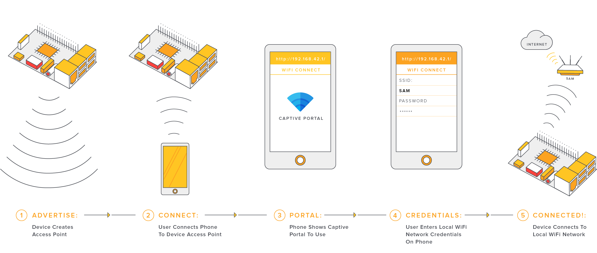
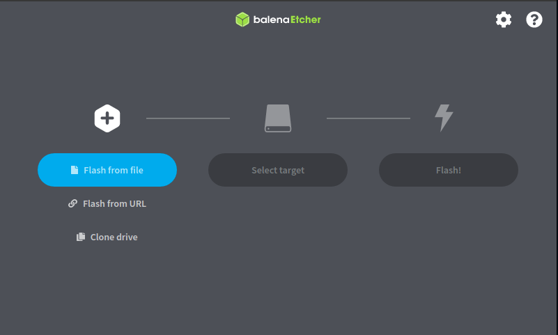
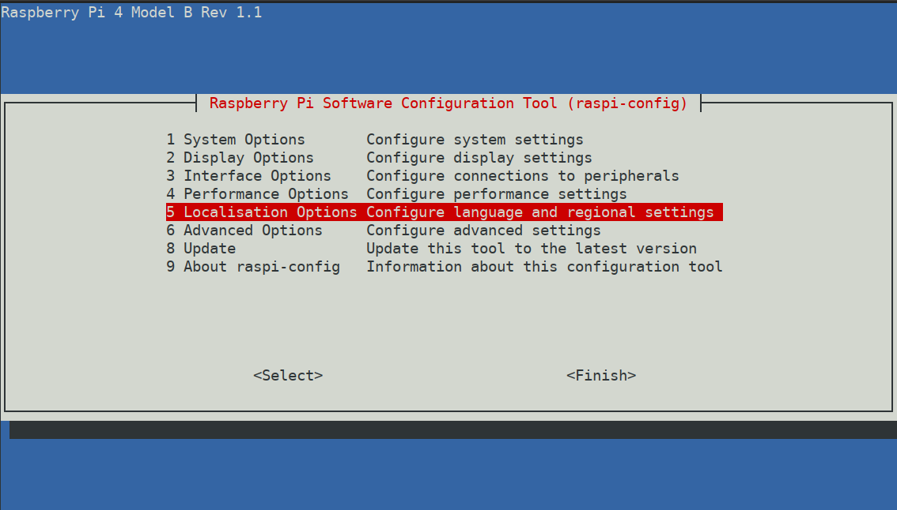
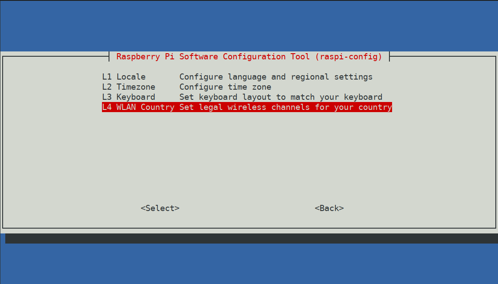
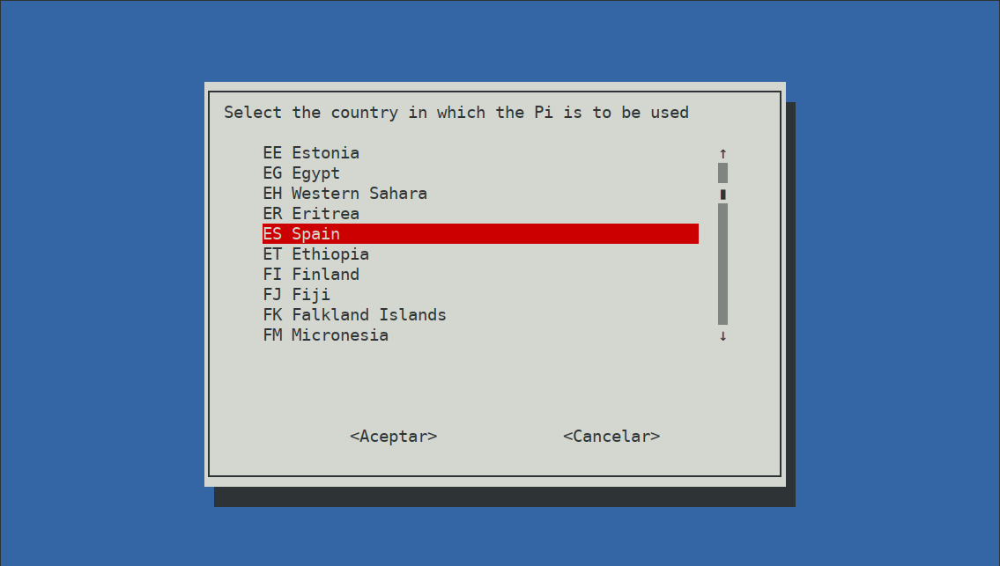
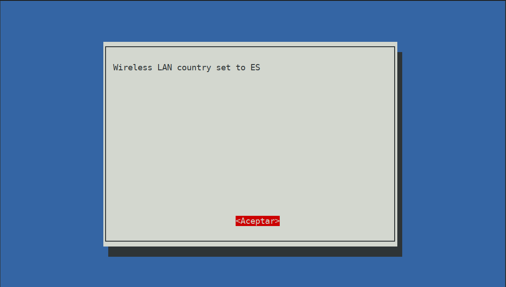
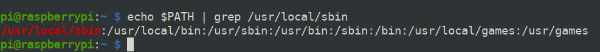
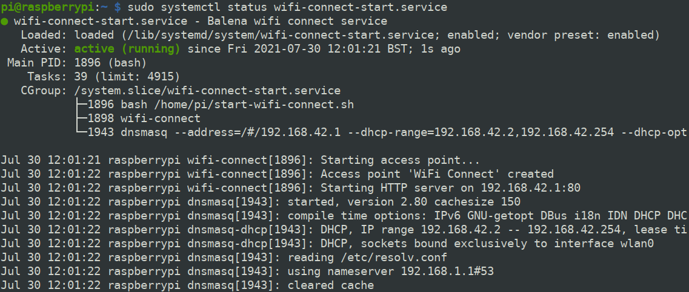

## El problema: cargar con un portátil para uso ocasional

Este verano tengo planeado volver a mi isla natal para visitar a seres queridos que hace más de un año que no veo. La
idea es viajar ligero, por lo que llevarme el macbook no me parecía una gran opción. Sin embargo, quiero tener la opción
de poder programar o trabajar en mi blog si se me apetece. La idea es que sea algo puntual, por lo que se reafirma mi
idea de que llevarme el portátil para eso no merece la pena.

Lo que si tengo claro que quiero llevarme es mi iPad Air. Aparte de para leer, también lo uso para escribir gracias
al [Smart Keyboard](https://www.apple.com/es/shop/product/MX3L2Y/A/smart-keyboard-para-el-ipad-8ª-generación-español).
Por otro lado, hace tiempo había visto este [vídeo de Tech Craft](https://youtu.be/IR6sDcKo3V8) en el que el autor
comenta cómo la [Raspberry Pi 4](https://www.raspberrypi.org/products/raspberry-pi-4-model-b/) se ha convertido en el
accesorio favorito para su iPad Pro. Esto se debe a que la Raspberry Pi 4 se alimenta gracias a un puerto USB C, el cual
también se puede usar para intercambio de datos. Si a esto le sumamos que el iPad Pro también tiene un puerto USB C, que
se puede usar tanto para transmitir energía como datos, podemos conectarlo a una Raspberry Pi 4 y conseguiremos no sólo
encender la Raspberry, sino también conectarnos a ella a través de una red LAN. Una vez conectada sólo tenemos que
acceder a la Raspberry por ssh usando el usuario y la IP por defecto: `ssh pi@10.55.0.1` y ya podemos hacer todo lo que
queramos en este sistema Linux: instalar Node.js, Ruby, Jupyter, etc.

¡Qué maravilla! ¡Y qué fácil! Claro que sí, si tienes un iPad Pro. Si tienes otro modelo de iPad o simplemente otra
tablet, este método no te servirá. Y como no tenía ganas de gastarme casi 2.000 € en otro iPad, más que nada porque el
que tengo cubre ya todas mis necesidades, me tocó investigar. Por suerte, en el mismo canal de YouTube tienen otro vídeo
en el que explica
[cómo conectarte a la Raspberry sin necesidad de USB C](https://www.youtube.com/watch?v=YbvSS8MJm2s&t=618s&pp=sAQA). En
este vídeo explica cómo convertir la Raspberry (no necesariamente la 4, cualquiera con WiFi vale) en un punto de acceso
y conectarte por WiFi a ella y desde ahí conectarte por ssh. Sin embargo, el software para crear el punto de
acceso ([RaspAP](https://raspap.com)) y su instalación se me hizo engorroso, aparte de que aunque lo intenté varias veces
ninguna me funcionaba con éxito.

Lejos de rendirme (más que nada porque ya tenía todo el *hype* en el cuerpo) seguí investigando y buscando soluciones. Me paré a
pensar hasta qué punto necesitaba que la Raspberry fuera a un punto de acceso, realmente en mi caso, sólo necesitaba que
se conectara a la misma red que iba a estar conectado mi iPad. Buscando en esta dirección acabé encontrando lo que
necesitaba: [WiFi Connect](https://github.com/balena-os/wifi-connect) (bendito sea el Open Source).

## La solución: conéctate a tu Raspberry Pi gracias a WiFi Connect


WiFi Connect es un software que puedes instalar en tu Raspberry Pi para que en caso de que no encuentre ninguna red que
hayas guardado previamente, cree un punto de acceso al que te puedas conectar y configurar la WiFi. La gran ventaja es que
lo puedes hacer desde cualquier dispositivo: tu móvil, tablet, pc, lo que sea que se pueda conectar a un navegador web.

Además el software es bastante simple de instalar más allá de algún pequeño problema con el que me encontré, pero que
resultó bastante fácil de solventar. Vamos a instalarlo paso a paso desde 0:

### 1. Descarga la imagen de Raspberry Pi OS

Para empezar deberemos descargar el sistema operativo que vayamos a usar en la Raspberry Pi. Hay varias opciones como
puedes ver [aquí](https://www.raspberrypi.org/software/operating-systems/#third-party-software), pero prefiero usar
[Raspberry Pi OS](https://www.raspberrypi.org/software/operating-systems/#raspberry-pi-os-32-bit), que al final es un
Debian y es la distro oficial para Raspberry y la más usada. Concretamente usaremos la imagen que contiene el escritorio
y todo el software recomendado. Es la imagen más pesada, pero también la más completa y si no has trasteado mucho con
Raspberry es la mejor opción.

### 2. Instala Raspberry Pi OS en tu tarjeta microSD

Una vez tengamos descargada la imagen de Raspberry Pi OS nos tocará flashear la imagen en la tarjeta microSD que vayamos a
usar en nuestra Raspberry. Una microSD de 16GB nos bastará, pero si tienes pensado meterle muchos proyectos o crees que
se te quedará corta puedes usar una de mayor capacidad.

Para flashear la imagen te recomiendo usar [Balena Etcher](https://www.balena.io/etcher/), es un software justo para
este propósito. Además, es suuuuuper fácil de usar. Sólo tienes que:

1. Seleccionar la imagen que quieres flashear, para ello primero tendrás que descomprimir el zip y seleccionar el archivo con extensión `.iso`. 
1. Elegir en qué dispositivo la quieres flashear, en nuestro caso la tarjeta microSD. 
1. Darle al botón *Flash!*
1. Esperar a que termine. El tiempo que tarde depende de la microSD y de tu sistema, pero en mi caso tardó unos 20 minutos.

<figure role="group" id="balena-etcher">
    
    <figcaption>
        <small>
            Balena Etcher es un software maravilloso para flashear imágenes en dispositivos.
        </small>
    </figcaption>
</figure>

También tienes la opción de hacer el clásico comando `dd` si estás haciendo esto desde un sistema UNIX, pero si
entiendes esta frase es que no necesito explicártelo y si no la entiendes no te compliques la vida y usa Balena Etcher.

### 3. Habilita el servicio de ssh en tu Raspberry Pi

Tanto para conectarla la Raspberry Pi a tu tablet, como para el proceso de instalación, vas a necesitar conectarte por
ssh. Realmente el proceso de instalación podrías hacerlo también conectando la Raspberry a un monitor, teclado y ratón.
Sin embargo, por comodidad es bastante más cómodo hacerlo por ssh.

La forma más fácil de hacerlo es **crear un archivo vacío y sin extensión con el nombre `ssh`** en la raíz de *boot*. De
esta manera no necesitas conectar la Raspberry a nada para poder empezar a trastear con ella. Para crear el archivo
puedes hacerlo por terminal o por entorno gráfico, como te sea más cómodo. En mi caso lo hice en mi Ubuntu por terminal
con este comando: `touch /media/ulises/boot/ssh`. Si también usas Linux sería cambiar *ulises* por tu usuario. En caso
de que uses macOS el comando sería `touch /Volumes/boot/ssh`.

### 4. Conecta tu Raspberry Pi por Ethernet a tu router
   
Para evitar perder la conexión una vez se instale wifi-connect es mejor que conectemos la Raspberry por cable en vez de
por WiFi. 

### 5. Accede por ssh a tu Raspberry Pi 

Ahora ya puedes encender a tu Raspberry y conectarte a ella por ssh. Debería ser algo tan sencillo como ejecutar desde
tu terminal `ssh pi@raspberrypi.local`. Este paso lo hago desde mi ordenador, pero también lo puedes hacer desde tu
tablet o iPad. Para iPad el cliente ssh que uso y recomiendo es [Blink](https://blink.sh). Es de pago, pero es
maravillosamente cómodo.

### 6. Actualiza tu Raspberry Pi

Para evitar que algo falle por no tener algún paquete del sistema actualizado vamos a actualizarlo
ejecutando `sudo apt update -y && sudo apt upgrade -y`. Este proceso tardará un rato. Si por alguna extraña razón se te
queda congelado el proceso de actualización no tengas miedo de cerrar la terminal, volver a conectarte por ssh y volver
a ejecutar el comando.

El `-y` en los comandos es para
que en caso de que nos pida confirmar alguna actualización automáticamente lo haga sin esperar nuestra confirmación.
Aunque te preguntara le ibas a dar que sí a todo, tú lo sabes, yo lo sé, todo el mundo lo sabe. ¿Acaso te has leído
alguna vez los términos y condiciones de algo antes de darle a *Aceptar*? Por eso mismo.

### 7. Configura el país en el que vas a usar la WiFi

Para esto escribimos en la terminal de la Raspberry `sudo raspi-config`. Nos pedirá la contraseña que será `raspberry`,
a menos que la hayamos cambiado previamente.

Seleccionamos con las flechas del teclado la opción *Localisation Options* y apretamos la tecla *ENTER*



Ahora seleccionamos la opción `WLAN Country`.



Seleccionamos el país donde vayamos a usar la Raspberry, en mi caso es España.



Si todo ha salido bien debería de aparecer una pantalla como la siguiente, en la que lo único que tendremos que hacer es
darle a *ENTER*.



Una vez hayamos vuelto a la pantalla principal de raspi-config, sólo tenemos que usar la tecla *TAB* para llegar hasta
la opción `Finish` y darle a *ENTER*. Te pedirá que si quieres reiniciar la Raspberry, dile que sí.

### 8. Añade /usr/local/sbin al PATH

Wifi Connect se instala por defecto en `/usr/local/sbin`. Esto me dió problemas la primera vez que lo instalé
porque `/usr/local/sbin` no estaba en el PATH de mi Raspberry. Esto se arregla
ejecutando `echo "PATH=$PATH:/usr/local/sbin" >> $HOME/.bashrc`. De todos modos, a lo mejor en tu caso no es necesario.
Para comprobar si necesitas actualizar el PATH ejecuta `echo $PATH | grep /usr/local/sbin`. Si aparece es que no
necesitas hacer este paso, como puedes ver en la siguiente imagen:



Si vas a cambiar bash por zsh, fish o cualquier otra shell de tu preferencia recuerda actualizar la variable PATH
también para ella. 

### 9. Instala WiFi Connect

Sólo tendremos que ejecutar este
comando `bash <(curl -L https://github.com/balena-io/wifi-connect/raw/master/scripts/raspbian-install.sh)` y comenzará
el proceso de instalación. Cuando nos pregunte para instalar NetworkManager le diremos que sí.


### 10. Añade script para arrancar WiFi Connect

Crearemos el siguiente script en `/home/pi/start-wifi-connect.sh`:
```bash
#!/usr/bin/env bash
# Is there an active WiFi connection?
iwgetid -r

if [ $? -eq 0 ]; then
    printf 'Skipping WiFi Connect\n'
else
    printf 'Starting WiFi Connect\n'
    wifi-connect
fi
```

Puedes hacerlo a mano tirando de `nano` o también puedes dejar que este comando haga la magia por ti:
`curl https://gist.githubusercontent.com/ulisesantana/5f13880a18541459ccd90ef38d9e9fbe/raw/2acd59d6447f3a1779371fdedd58b3c24eaa9fd2/start-wifi-connect.sh > $HOME/start-wifi-connect.sh`

Una vez tenemos ya el script vamos a darle permisos de ejecución con este comando `sudo chmod +x $HOME/start-wifi-connect.sh`.


### 11. Añade servicio para WiFi Connect

Ahora vamos a crear un servicio para que WiFi Connect se inicie automáticamente al encender la Raspberry. Como antes
tenemos la opción de hacerlo a mano creando `/lib/systemd/system/wifi-connect-start.service` con el siguiente contenido: 

```bash
[Unit]
Description=Balena wifi connect service
After=NetworkManager.service

[Service]
Type=simple
ExecStart=/home/pi/start-wifi-connect.sh
Restart=on-failure
StandardOutput=syslog
SyslogIdentifier=wifi-connect
Type=idle
User=root

[Install]
WantedBy=multi-user.target
```

O también podemos crearlo tirando de estos dos comandos:

```bash
# Add wifi-connect service
## Download service file
wget curl https://gist.githubusercontent.com/ulisesantana/5f13880a18541459ccd90ef38d9e9fbe/raw/2acd59d6447f3a1779371fdedd58b3c24eaa9fd2/wifi-connect-start.service
## Move it to relevant directory
sudo mv wifi-connect-start.service /lib/systemd/system/wifi-connect-start.service
```

### 12. Habilita servicio para WiFi Connect

Con el servicio de WiFi Connect creado, ahora sólo tenemos que habilitarlo para que se inicie automáticamente al
encender la Raspberry. Sólo tenemos que ejecutar este comando `sudo systemctl enable wifi-connect-start.service`. Ahora
para iniciarlo ejecutamos `sudo systemctl start wifi-connect-start.service` y por último para comprobar si está
funcionando ejecuta `sudo systemctl status wifi-connect-start.service`. Si todo ha ido bien deberías ver algo como esto:



### 13. Conecta tu Raspberry Pi a tu red WiFi

Coge tu móvil o cualquier otro dispositivo con conectividad WiFi y conéctate a la nueva red *WiFi Connect*, la cual no
tiene contraseña. Automáticamente te abrirá el portal de *WiFi Connect* en el que tendrás que
configurar a qué red WiFi quieres que se conecte la Raspberry.

Si no te abre el portal, entra en un navegador web y trata de abrir una nueva página. De esta manera acabará saltándote igualmente el portal. 


Ahora desconecta el cable de Ethernet de la Raspberry, reiníciala y trata de conectarte por ssh de nuevo. Si todo ha salido bien
deberías de poder conectarte y empezar a trastear con ella. La próxima vez que enciendas la Raspberry y no reconozca
ninguna red WiFi volverá a crear la red *WiFi Connect* y podrás conectarte a ella nuevamente para configurar a qué red
WiFi quieres que se conecte.
